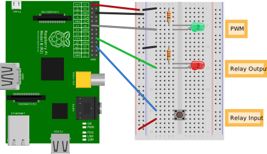

# Flux Capacitor
If Pull-Down is triggered on an input pin then set an output pin on HIGH for
Relais activation and create a PWM-Signal depending on received values from
Kostals plenticore through iobroker.

## Dependency
You'll need python3-rpi.gpio_0.7.0-0.1~bpo10+1_armhf.deb to be installed.

## Install

```bash
git clone https://github.com/yodaaut/flux_capacitor.git
cd flux_capacitor
mkdir -p /opt/scripts
cp flux_capacitor.py /opt/scripts/
chmod +x /opt/scripts/flux_capacitor.py
cp flux_capacitor.service /lib/systemd/system/
systemctl enable --now flux_capacitor.service
```

## Configuration
Change preferences here
```python
def set_config():
    ##INFO
    # BCM    <=> BOARD 'usage'
    # gpio17 <=> pin11 'pwm_output'
    # gpio24 <=> pin18 'HIGH/low relais output'
    # gpio25 <=> pin22 'button/relais input'
    # program uses BOARD mode
    GPIO.setmode(GPIO.BOARD)
    globals()['gpio_pwm']               = 11
    globals()['gpio_output']            = 18
    globals()['gpio_input']             = 22

    globals()['gpio_frequency']         = 1000
    globals()['kostal_start_value']     = 500
    globals()['kostal_max_value']       = 4500
    globals()['plenticore_instance']    = 0
    globals()['debug']                  = False

    globals()['pollinterval']           = get_pollinterval()
```

gpio_pwm => which pin should be used for PWM-Signal (default 11)  
gpio_output => which pin should be used for HIGH/low output (default 18)  
gpio_input => which pin should be used for Pull-Down Input (default 22)  
gpio_frequency => value in Hz  
kostal_start_value => any value below will be ignored on output  
kostal_max_value => should be set to MAX Value  
plenticore_instance => which instance to use  
debug => turn on debug messages (shown on commandline or journalctl)  
pollinterval => gets interval setting from Plenticore config (don't change)  

## Schematics



## Bill of Materials

### Assembly List

| Label         | Part Type           | Properties                                                   |
| ------------- | ------------------- | ------------------------------------------------------------ |
| LED1          | Green (565nm) LED   | package 0603 [SMD]; color Green (565nm)                      |
| LED2          | Red (633nm) LED     | package 0603 [SMD]; color Red (633nm)                        |
| R1            | 330Ω Resistor       | package 0805 [SMD]; resistance 330Ω; tolerance ±5%           |
| R2            | 330Ω Resistor       | package 0805 [SMD]; resistance 330Ω; tolerance ±5%           |
| Raspberry Pi1 | Raspberry Pi B rev2 | variant Raspberry Pi B(Rev 02); processor Broadcom SoC BCM2835 ARMv6 |
| S1            | Momentary Switch    | package ksa_sealed_tac_switch; variant ksa_sealed            |

### Shopping List

| Amount | Part Type           | Properties                                                   |
| ------ | ------------------- | ------------------------------------------------------------ |
| 1      | Green (565nm) LED   | package 0603 [SMD]; color Green (565nm)                      |
| 1      | Red (633nm) LED     | package 0603 [SMD]; color Red (633nm)                        |
| 2      | 330Ω Resistor       | package 0805 [SMD]; resistance 330Ω; tolerance ±5%           |
| 1      | Raspberry Pi B rev2 | variant Raspberry Pi B(Rev 02); processor Broadcom SoC BCM2835 ARMv6 |
| 1      | Momentary Switch    | package ksa_sealed_tac_switch; variant ksa_sealed            |

## Testing

If you haven't installed iobroker on your Raspberry then just symlink
iobroker-test to your binary PATH.
This will fake the necessary commands.
```bash
ln -s $(pwd)/iobroker_test /usr/local/sbin/iobroker
```
There is a script called "iobroker", which should fake the iobroker commands if
you haven't installed iobroke

## Logging
If debug is enabled you can display messages with:
```bash
journalctl --boot --unit flux_capacitor.service --follow
```
